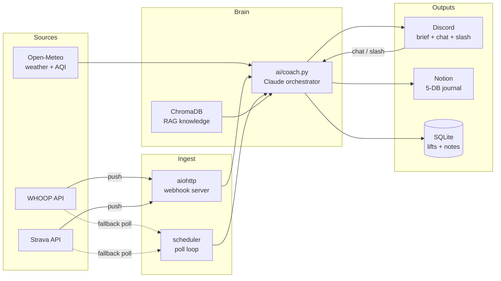

# fitness-agent

> A personal AI fitness coach that lives in Discord. Pulls WHOOP recovery data
> and Strava activities, lets you log lifts via chat, writes a Notion training
> journal in the background, and sends a data-driven morning brief the moment
> your overnight WHOOP recovery lands. Powered by Claude.

[](https://www.python.org/downloads/)
[](LICENSE)
[](https://github.com/psf/black)
[](#status-and-scope)

---

## What it does

- **Data-driven morning brief.** Fires the moment your overnight WHOOP
  recovery record lands (anywhere in a configurable poll window). Reasons over
  a 7-day trend, not just today, and prescribes a specific session — pace,
  HR ceiling, lift template — based on recovery, sleep, weather, and your
  training plan.
- **Conversational coach.** Ask anything: *"should I run hard today?"*,
  *"how has my bench progressed?"*, *"how much protein on a hard lift day?"*,
  *"why do I feel tired despite a green recovery?"*. Routed to Claude with
  your live data + a RAG knowledge base of running, strength, recovery,
  nutrition, sleep, periodization, and Stoic mindset notes.
- **Lift logging by chat.** Type *"bench 3x10 at 145"* in Discord. It parses
  the set, logs it to SQLite + Notion, tracks progression, flags PRs.
- **Slash-command tree.** `/recovery`, `/sleep`, `/strain`, `/load`,
  `/performance`, `/goal`, `/workout`, `/plan`, `/debrief`, `/swap`,
  `/liftstart`/`/liftend`, `/cost` — quick views and controls without
  typing free-form prompts.
- **Notion training journal** with five linked databases — `Schedule`,
  `Lifts`, `Lift Sets`, `Runs`, `Daily Log` — auto-written in the background.
- **Webhook-driven** Strava + WHOOP ingestion (no nightly polling) when you
  expose a public HTTPS endpoint via Caddy.
- **Post-workout debrief** — fuses Strava pace + WHOOP HR/zones into a
  single read on whether the session matched intent.
- **Sunday Stoic reflection** — short, weekly mindset check using your
  actual training week as the prompt.

---

## Status and scope

This is a personal project I built for myself. It's a working reference
implementation that another developer with similar accounts (WHOOP +
Strava + Discord + Anthropic + Notion) could fork and run with modest
config changes — but it's not a polished product, there's no
multi-tenancy, and the system prompt is opinionated toward my own
training style. PRs that improve generality are welcome; see
[CONTRIBUTING.md](CONTRIBUTING.md).

---

## Architecture



---

## Stack

| Layer | Tech |
| --- | --- |
| Runtime | Python 3.11+, asyncio |
| Discord | [discord.py](https://discordpy.readthedocs.io/) |
| LLM | [Anthropic Claude](https://docs.anthropic.com/) (Sonnet for briefs, Haiku for chat) |
| Data | WHOOP API (recovery / sleep / HRV / strain), Strava API (activities) |
| Weather | [Open-Meteo](https://open-meteo.com/) (no key required) |
| Journal | Notion API (4 databases: Schedule / Lifts / Runs / Daily Log) |
| Local store | SQLite via [aiosqlite](https://github.com/omnilib/aiosqlite) |
| RAG | [ChromaDB](https://www.trychroma.com/) + [sentence-transformers](https://www.sbert.net/) |
| Webhook server | aiohttp (co-hosted in the bot's event loop) |

---

## Setup

### 1. Clone and install

```bash
git clone https://github.com/dylanglatt/fitness-agent.git
cd fitness-agent
python3.11 -m venv venv
source venv/bin/activate          # Windows: venv\Scripts\activate
pip install -r requirements.txt
```

### 2. Configure environment

```bash
cp .env.example .env
```

Fill in the values in `.env`. The credential walkthroughs below cover each
section. Every Notion database id is independently optional — leave one
blank and the bot just skips writes to that DB.

### 3. (Optional) Build the RAG knowledge base

The `knowledge/` directory holds markdown notes on running, lifting,
recovery, sleep, nutrition, periodization, and Stoic philosophy. The coach
embeds and retrieves from these to ground its answers.

```bash
pip install chromadb sentence-transformers
python knowledge/ingest_knowledge.py
```

This is a one-time step (~80 MB embedding-model download on first run). The
bot still works without it — RAG retrieval just returns empty.

### 4. Run

```bash
python main.py
```

---

## Getting your API credentials

### Discord
1. [discord.com/developers/applications](https://discord.com/developers/applications) → New Application → Bot → copy the token
2. Enable **Message Content Intent** under Privileged Gateway Intents
3. Invite the bot to your server with: Send Messages, Read Message History, Use Slash Commands
4. In Discord settings, enable Developer Mode, then right-click your own username → Copy User ID
5. Copy the channel IDs for your daily-brief and training channels

### Strava
1. [strava.com/settings/api](https://www.strava.com/settings/api) → create an app
2. Copy Client ID + Client Secret into `.env`
3. Run the one-time OAuth flow to get a refresh token — see [`docs/strava_auth.md`](docs/strava_auth.md)

### WHOOP
1. [developer.whoop.com](https://developer.whoop.com) → create an app
2. Copy Client ID + Client Secret into `.env`
3. Run the one-time OAuth flow to get a refresh token — see [`docs/whoop_auth.md`](docs/whoop_auth.md)

### Anthropic
1. [console.anthropic.com](https://console.anthropic.com) → API Keys → create one

### Notion
1. [notion.so/profile/integrations](https://www.notion.so/profile/integrations) → New integration (Internal) → copy the secret
2. Create five databases under a parent "Fitness" page:
   - **Schedule** — day-level index (Training Group, Workout, date)
   - **Lifts** — one row per exercise per workout (Sets, Reps, Weight lb, RPE)
   - **Lift Sets** — one row per *set* performed, related back to the parent
     Lifts row. Backs strength-progression views. Optional — leave blank to
     log workout-summary rows only.
   - **Runs** — one row per cardio activity (Distance mi, Pace, Zone %)
   - **Daily Log** — one row per day with WHOOP physiology + morning brief text
3. For each database, click ••• → Connections → add your integration. *Without
   this step, the API returns 404 even with a valid key.*
4. Copy each database ID from its URL (the 32-char chunk before `?`) into the
   matching `NOTION_*_DATABASE_ID` in `.env`. Any ID can be left blank — the
   bot skips writes to that DB rather than crashing.

### Webhooks (optional)
If you want push-based ingestion instead of polling — see
[`docs/webhooks.md`](docs/webhooks.md) for the full Caddy + DigitalOcean
walkthrough. Leave `WEBHOOK_PORT=0` to disable.

---

## Project structure

```
fitness-agent/
├── main.py                    # Entry point
├── config.py                  # All config / env vars
├── requirements.txt
├── .env.example
├── bot/
│   ├── discord_bot.py         # Bot setup + message routing
│   ├── commands.py            # Slash-command tree
│   └── scheduler.py           # Brief / summary / reflection triggers
├── integrations/
│   ├── strava.py              # Strava API client
│   ├── whoop.py               # WHOOP API client
│   ├── notion.py              # Notion write client (5-DB)
│   ├── weather.py             # Open-Meteo weather + AQI
│   └── webhook_server.py      # aiohttp webhook receiver
├── ai/
│   ├── coach.py               # Orchestrates data + Claude calls
│   ├── prompts.py             # System prompt + persona
│   └── knowledge_retriever.py # ChromaDB RAG retriever
├── data/
│   └── database.py            # SQLite for lifts + notes
├── knowledge/                 # Markdown knowledge base for RAG
│   ├── 01_running_vo2max.md
│   ├── 02_strength_hypertrophy.md
│   ├── ...
│   └── ingest_knowledge.py    # Embeds + stores into ChromaDB
├── scripts/                   # One-time setup / maintenance scripts
│   ├── backfill_notion.py
│   ├── strava_subscribe.py
│   ├── strava_unsubscribe.py
│   └── ...
├── tests/
│   └── test_debrief.py
└── docs/
    ├── strava_auth.md         # Strava OAuth walkthrough
    ├── whoop_auth.md          # WHOOP OAuth walkthrough
    └── webhooks.md            # Caddy + webhook deploy walkthrough
```

---

## Deployment (self-hosted)

A small Ubuntu VPS (the [Hetzner](https://hetzner.com) ~$5/mo or
[DigitalOcean](https://digitalocean.com) $6/mo tier) is plenty. The
included [GitHub Actions workflow](.github/workflows/deploy.yml) does
zero-downtime redeploy on push to `main`; configure `DEPLOY_HOST`,
`DEPLOY_USER`, and `DO_SSH_KEY` as repo secrets.

Run as a systemd service:

```ini
# /etc/systemd/system/fitness-agent.service
[Unit]
Description=fitness-agent
After=network.target

[Service]
User=ubuntu
WorkingDirectory=/home/ubuntu/fitness-agent
EnvironmentFile=/home/ubuntu/fitness-agent/.env
ExecStart=/home/ubuntu/fitness-agent/venv/bin/python main.py
Restart=always
RestartSec=5

[Install]
WantedBy=multi-user.target
```

```bash
sudo systemctl enable --now fitness-agent
sudo journalctl -u fitness-agent -f      # tail logs
```

For webhook-driven ingestion (Strava + WHOOP push), put Caddy in front to
terminate TLS and reverse-proxy `https://your-host/webhooks/*` to
`127.0.0.1:$WEBHOOK_PORT`. Full walkthrough in [`docs/webhooks.md`](docs/webhooks.md).

---

## Tests

```bash
python -m pytest tests/
```

The current test suite covers the post-workout debrief logic and WHOOP
webhook signature verification. PRs adding tests for the scheduler and
Notion writers are welcome.

---

## Contributing

See [CONTRIBUTING.md](CONTRIBUTING.md). For security disclosures, see
[SECURITY.md](SECURITY.md).

## License

[MIT](LICENSE) © Dylan Glatt
